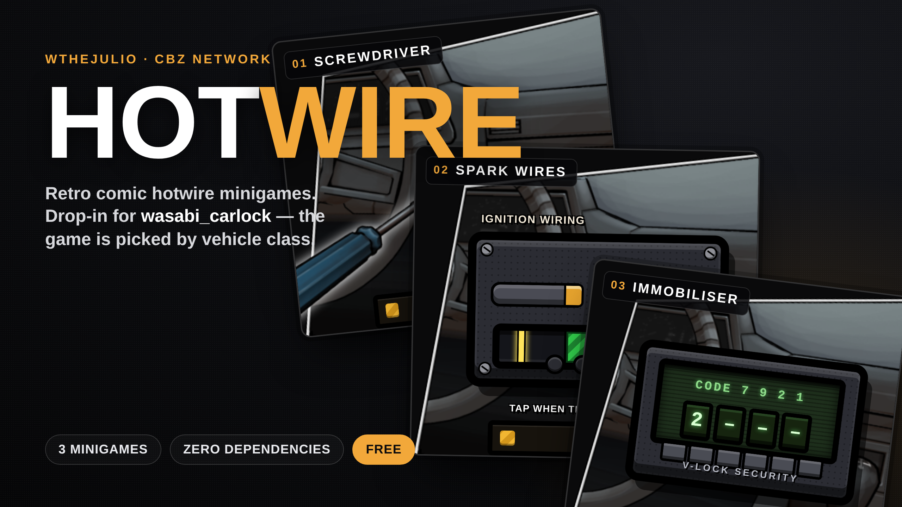
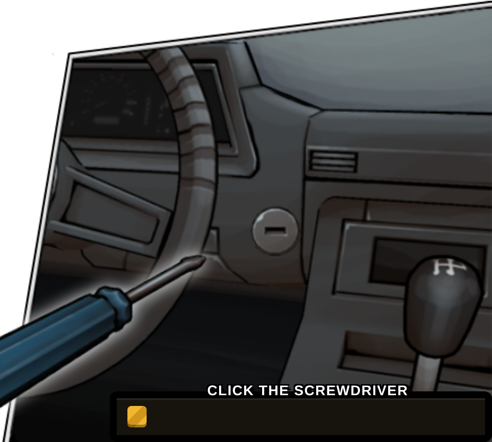
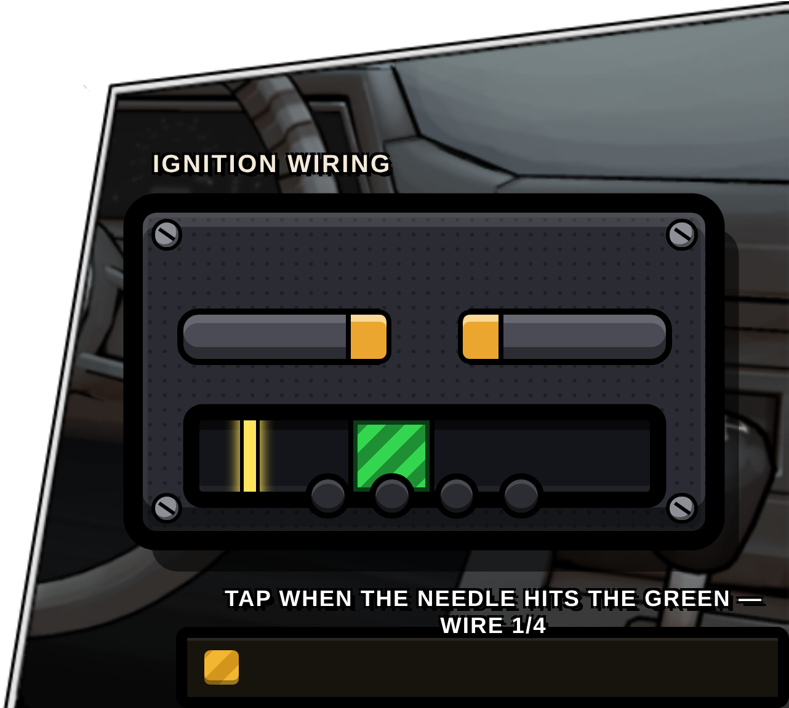
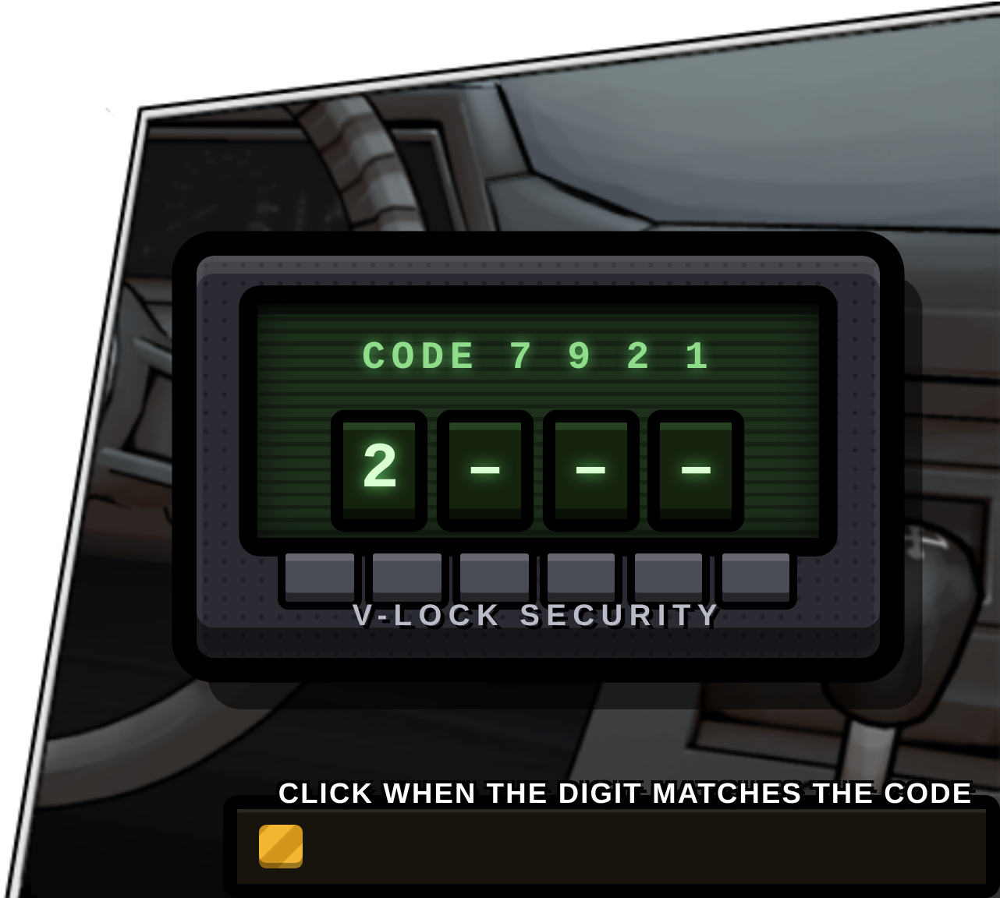

# cbz_hotwire



## CBz Network — cbz_hotwire | Retro Hotwire Minigames · Drop-in for wasabi_carlock

Three hand-drawn, comic-style hotwire minigames that replace wasabi_carlock's plain skill check with something players actually feel. The game is chosen automatically by vehicle class — a beat-up sedan gets a screwdriver jammed in the ignition barrel, a supercar gets an immobiliser bypass. It ships as a **drop-in**: add the resource, paste one snippet into the wasabi bridge, restart, and every hotwire on your server becomes one of three tense little games. Nothing else on your server is touched. Zero dependencies, fully config-driven, and free & open-source. Created by **wthejulio** — CBz Network.

## Features
- **Three distinct minigames** — screwdriver, spark wires and immobiliser bypass, each its own mechanic and its own feel
- **Picked by vehicle class** — group GTA classes into named categories and set which games and which difficulty each one gets
- **Drop-in for wasabi_carlock** — one snippet in the bridge's `skillCheck`, hotwire only; lockpick and everything else stay exactly as they were
- **Standalone too** — any script can trigger a game through a single blocking export, wasabi not required
- **Zero dependencies** — no ox_lib, no dispatch, nothing to install
- **Screwdriver** — spin the driver into invisible catch zones and hold to lock; rush it and it slips back to the start
- **Spark wires** — tap the stripped ignition wires when the current needle hits the green; the zone shrinks and the needle speeds up every round, one miss fails
- **Immobiliser** — lock each scrolling digit of the security code on time; a wrong press accelerates the whole cycle
- **One mistake = fail** — tense by design, toggle it off in config if you want it forgiving
- **Synth sound, no files** — every SFX is generated live in the UI with Web Audio, nothing to stream
- **Thief animation + tool prop** — plays while hotwiring, dict / clip / prop all configurable
- **Car alarm on failure** — the vehicle's own alarm kicks off when you blow it
- **Optional item requirement** — gate hotwiring behind an ox_inventory item, with a break-on-fail chance
- **XP & skill-based difficulty** — reward your skill system on success, and let higher skill quietly ease the game (cbz_skills-ready)
- **Server anti-cheat** — result rate-limit plus rejection of impossibly-fast successes
- **Discord logging** — optional webhook for every attempt
- **Retro comic art** — the minigames are mounted right in the dashboard, tools and panels drawn in a hand-inked style
- **No backdrop-filter** — safe in NUI, never a black box; jQuery is baked in, so it works fully offline

## Preview

| Screwdriver | Spark wires | Immobiliser |
| :---: | :---: | :---: |
|  |  |  |

## Install (wasabi_carlock)

1. Drop `cbz_hotwire` in your resources and `ensure cbz_hotwire`.
2. wasabi_carlock's hotwire is escrowed, so it's hooked through the bridge's customization file — the extension point Wasabi provides for exactly this. Open `wasabi_bridge/customize/client/skillCheck.lua` and paste this at the very top of `WSB.skillCheck(data)`:

```lua
    -- cbz_hotwire — hand wasabi_carlock's hotwire off to the minigame.
    -- Hotwiring only happens from wasabi_carlock while in the DRIVER seat
    -- (its lockpick is done outside the car), so everything else falls through.
    if GetResourceState("cbz_hotwire") == "started" then
        local invoker = GetInvokingResource and GetInvokingResource() or nil
        if invoker == "wasabi_carlock" or invoker == nil then
            local ped = PlayerPedId()
            local veh = GetVehiclePedIsIn(ped, false)
            if veh ~= 0 and GetPedInVehicleSeat(veh, -1) == ped then
                return exports.cbz_hotwire:startMinigame() or false
            end
        end
    end
```

That's it — lockpick and every other skill check keep using your normal one. Police alerts stay on wasabi_carlock (`Config.notifyPolice.hotwire` in its own config), so there's no double alert and no dispatch dependency.

## Exports (client)

Standalone — any script can call it, wasabi is not required.

- `exports.cbz_hotwire:startMinigame(game, difficulty, isTest)` → `boolean` (blocking)
  - `game` = `"screw" | "spark" | "immo"` (nil ⇒ random from the vehicle category)
  - `difficulty` = `"easy" | "medium" | "hard"` (nil ⇒ the vehicle category's difficulty)
  - `isTest` = truthy to skip the server result + alarm (used by `/hwtest`)
- `exports.cbz_hotwire:stopMinigame()`

## Config

All tuning lives in `config.lua`:

- `Config.Categories` — group GTA vehicle classes into named categories (economy / average / sport / luxury / special)
- `Config.CategorySettings` — per category, which minigames may appear (`games = { 'screw', 'spark', 'immo' }`, one picked at random) and the `difficulty`; `Config.DefaultCategory` covers unlisted classes
- `Config.Duration` — timer per difficulty (easy / medium / hard)
- `Config.Games.screw/spark/immo` — per-difficulty parameters of each minigame
- `Config.FailOnMistake` — one wrong input instantly fails the minigame
- `Config.Sound` — synthesised UI sound effects, no files (`{ enabled, volume }`)
- `Config.Animation` — thief anim + tool prop while hotwiring (`dict/clip/prop/bone/offset/rot`)
- `Config.Alarm` — the car's own alarm goes off on failure (`{ enabled, duration }`)
- `Config.RequireItem` — need an ox_inventory item to hotwire, may break on fail (OFF by default)
- `Config.Skills` — fire an XP-reward event on success, wire it to your skill system (OFF by default)
- `Config.Security` — server rate-limit + reject impossibly-fast successes
- `Config.Logs` — Discord webhook logging of attempts (OFF by default)

## Test commands (ESX staff groups)

- `/hwtest [easy|medium|hard] [screw|spark|immo]` — force a specific game/difficulty; no args = like a real hotwire (by category)
- `/hwstop` — force-close the minigame and release NUI focus

## License

Free & open-source under **GPL-3.0**. The screwdriver minigame is derived from B01_CTWHotWire by Binary 01 Studios (gush3l), licensed GPL-3.0 — see [LICENSE](LICENSE).

Developed by **wthejulio** · CBz Network.
